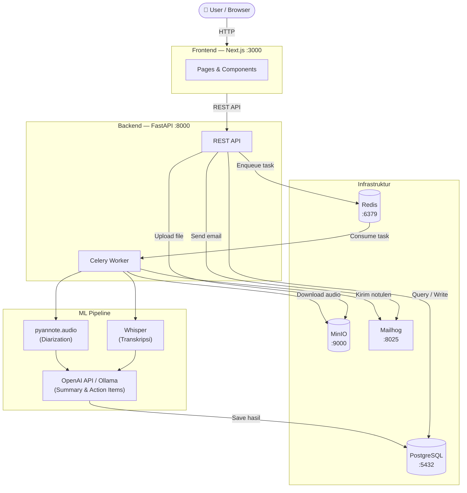

# MeetMate

> Your offline meeting companion. Auto-transcribe, summarize, and distribute notulen with zero cloud dependency.

MeetMate is an end-to-end meeting management application for offline meetings (rapat kantor, FGD, interview). It handles the full meeting lifecycle: scheduling, email invitations, attendance check-in, recording upload, automatic transcription and summarization, and notulen distribution to all participants.

Built fully self-hosted with local LLM. No data leaves your machine.

---

## Features

- Create meeting with schedule, location, agenda, and participant list
- Send email invitations with magic-link check-in (no login required for participants)
- Manual and link-based attendance check-in
- Upload audio recording (mp3, mp4, wav, m4a, max 2 hours)
- Automatic transcription — bilingual Bahasa Indonesia + English (Whisper large-v3)
- Speaker diarization — who said what (pyannote.audio)
- AI-generated summary, key decisions, and action items (Ollama + qwen2.5:7b)
- Auto-distribute notulen via email after processing
- Search across all meetings and notulen content
- CRUD recording document per meeting

---

## Tech Stack

| Layer | Tech |
|---|---|
| Frontend | Next.js, shadcn/ui, Tailwind CSS |
| Backend | FastAPI, Celery, Redis, PostgreSQL |
| ML Pipeline | Whisper large-v3, pyannote.audio, Hybrid LLM (OpenAI API / Ollama qwen2.5:7b) |
| Storage | MinIO (S3-compatible, local) |
| Email | Mailhog (dev) |
| Infra | Docker Compose |

---

## Architecture



**Alur utama recording:**
1. User upload audio → API simpan ke MinIO, taruh task di Redis
2. Celery Worker ambil task → download audio → jalankan Whisper → pyannote → LLM
3. Hasil disimpan ke PostgreSQL
4. Email notulen dikirim otomatis ke semua peserta via Mailhog

---

## Prerequisites

Wajib untuk Quick Start (full Docker):
- [Docker + Docker Compose](https://docs.docker.com/get-docker/)
- API Key salah satu LLM provider — **OpenAI API Key** (rekomendasi, tidak perlu GPU) atau **Ollama** (gratis, butuh GPU + RAM ≥ 16GB, lihat [Opsi LLM Provider](#opsi-llm-provider))

Tambahan, hanya kalau mau mode development hot-reload (lihat [docs/DOCKER_WORKFLOW.md](docs/DOCKER_WORKFLOW.md)):
- Python 3.11+
- Node.js 20+

---

## Quick Start

Semua service (frontend, backend, ML worker, database) jalan otomatis di Docker — tidak perlu install Python/Node.js.

```bash
git clone https://github.com/<your-username>/meetmate.git
cd meetmate
make init              # bikin .env dari .env.example
```

Isi `OPENAI_API_KEY` dan `HF_TOKEN` di `.env` yang baru dibuat:
```env
OPENAI_API_KEY=sk-...       # dari platform.openai.com
HF_TOKEN=hf_...             # dari huggingface.co, untuk download model pyannote
```
> Untuk `HF_TOKEN`: daftar di [huggingface.co](https://huggingface.co) → Settings → Access Tokens, lalu accept license model di [pyannote/speaker-diarization-3.1](https://huggingface.co/pyannote/speaker-diarization-3.1) dan [pyannote/segmentation-3.0](https://huggingface.co/pyannote/segmentation-3.0).

Lalu jalankan:
```bash
make up && make migrate
```
> Tanpa `make`? `cp .env.example .env` lalu `docker compose up -d && docker compose exec backend-api alembic upgrade head`.

Buka **http://localhost:3000**.

| Service | URL |
|---|---|
| Aplikasi | http://localhost:3000 |
| Backend API Docs | http://localhost:8000/docs |
| Mailhog (email preview) | http://localhost:8025 |
| MinIO Console | http://localhost:9001 |
| Adminer (DB viewer) | http://localhost:8080 |

Ganti dependency (`requirements.txt`/`package.json`)? Pakai `make build` (atau `docker compose up --build -d`) alih-alih `make up`. Perubahan kode Python/JS biasa tidak perlu rebuild.

**Mau hot-reload untuk development aktif** (kode langsung kepakai tanpa rebuild Docker)? Lihat [Mode Development](docs/DOCKER_WORKFLOW.md#mode-development) di `docs/DOCKER_WORKFLOW.md`.

---

## Opsi LLM Provider

Edit `.env` untuk memilih provider:

```env
# Pakai OpenAI (tidak butuh GPU, rekomendasi untuk laptop biasa)
LLM_PROVIDER=openai
OPENAI_API_KEY=sk-...
OPENAI_MODEL=gpt-4o-mini

# ATAU pakai Ollama lokal (butuh GPU, gratis)
LLM_PROVIDER=ollama
OLLAMA_BASE_URL=http://localhost:11434
OLLAMA_MODEL=qwen2.5:7b
```

Jika pakai Ollama, jalankan dulu di host machine (bukan di Docker — supaya bisa akses GPU langsung):
```bash
ollama pull qwen2.5:7b
ollama serve
```

Untuk panduan Docker lebih detail (termasuk mode development/hybrid), baca [docs/DOCKER_WORKFLOW.md](docs/DOCKER_WORKFLOW.md).

---

## Project Structure

```
meetmate/
├── frontend/          # Next.js app
├── backend/           # FastAPI app + Celery worker
├── ml/                # ML pipeline (Whisper, pyannote, Ollama)
├── docs/              # Documentation
│   ├── PRD.md
│   ├── API_CONTRACT.md
│   ├── ML_INTERFACE.md
│   ├── DOCKER_WORKFLOW.md
│   └── DOCKER_CHANGES.md
├── docker-compose.yml
├── .env.example
└── README.md
```

---

## Team

| Name | Role |
|---|---|
| Audi    | Koordinator, Backend |
| Helena  | Frontend             |
| Azmi    | ML                   |

---

## Development Status

MVP in development. Timeline: 4 weeks.

See [PRD](docs/PRD.md) for full product requirements.

---

## License

[MIT](LICENSE)