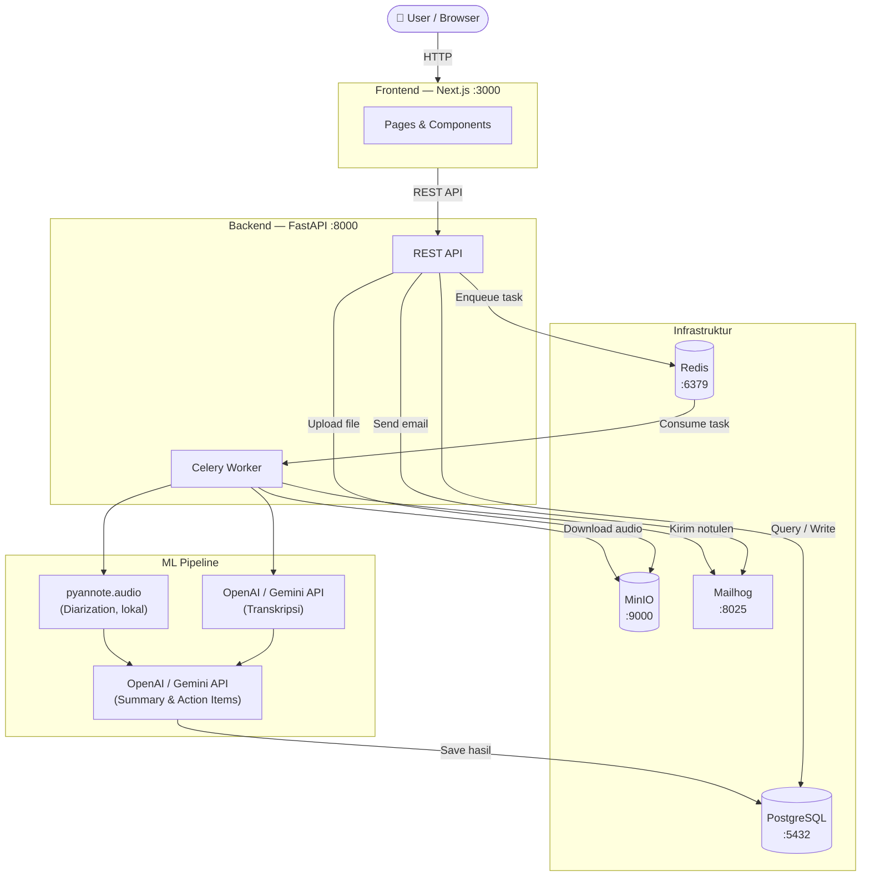

# Kioku

> Your meeting companion. Auto-transcribe, summarize, and distribute notulen — self-hosted infrastructure, cloud LLM for transcription/summarization.

Kioku is an end-to-end meeting management application for offline meetings (rapat kantor, FGD, interview). It handles the full meeting lifecycle: scheduling, email invitations, attendance check-in, recording upload, automatic transcription and summarization, and notulen distribution to all participants.

Infrastructure (database, storage, email) is fully self-hosted via Docker Compose, and speaker diarization always runs locally. Transcription and summarization go through a cloud LLM API (OpenAI by default, Gemini optional) — audio and transcript text are sent to that provider, so this is not a zero-cloud-dependency setup.

---

## Features

- Create meeting with schedule, location, agenda, and participant list
- Send email invitations with magic-link check-in (no login required for participants)
- Manual and link-based attendance check-in
- Upload audio recording (mp3, mp4, wav, m4a, max 2 hours)
- Automatic transcription in Bahasa Indonesia (OpenAI Whisper API or Gemini, switchable)
- Speaker diarization — who said what (pyannote.audio, always local)
- AI-generated summary, key decisions, and action items (OpenAI or Gemini, switchable)
- Auto-distribute notulen via email after processing
- Search across all meetings and notulen content
- CRUD recording document per meeting

---

## Tech Stack

| Layer | Tech |
|---|---|
| Frontend | Next.js, shadcn/ui, Tailwind CSS |
| Backend | FastAPI, Celery, Redis, PostgreSQL |
| ML Pipeline | pyannote.audio (diarization, local); OpenAI or Gemini (transcription, summary & action items — switchable via `LLM_PROVIDER`) |
| Storage | MinIO (S3-compatible, local) |
| Email | Mailhog (dev) |
| Infra | Docker Compose |

---

## Architecture



**Alur utama recording:**
1. User upload audio → API simpan ke MinIO, taruh task di Redis
2. Celery Worker ambil task → transkripsi (OpenAI/Gemini) → diarisasi (pyannote, lokal) → ringkasan & action items (OpenAI/Gemini)
3. Hasil disimpan ke PostgreSQL
4. Email notulen dikirim otomatis ke semua peserta via Mailhog

---

## Prerequisites

Wajib untuk Quick Start (full Docker):
- [Docker + Docker Compose](https://docs.docker.com/get-docker/)
- API Key salah satu LLM provider — **OpenAI API Key** (default) atau **Gemini API Key** (lihat [Opsi LLM Provider](#opsi-llm-provider)). Keduanya API cloud, tidak butuh GPU.

Tambahan, hanya kalau mau mode development hot-reload (lihat [docs/DOCKER_WORKFLOW.md](docs/DOCKER_WORKFLOW.md)):
- Python 3.11+
- Node.js 20+

---

## Quick Start

Semua service (frontend, backend, ML worker, database) jalan otomatis di Docker — tidak perlu install Python/Node.js.

```bash
git clone https://github.com/<your-username>/meetmate.git
cd meetmate
make init              # bikin .env dari .env.example
```

Isi `OPENAI_API_KEY` dan `HF_TOKEN` di `.env` yang baru dibuat:
```env
OPENAI_API_KEY=sk-...       # dari platform.openai.com
HF_TOKEN=hf_...             # dari huggingface.co, untuk download model pyannote
```
> Untuk `HF_TOKEN`: daftar di [huggingface.co](https://huggingface.co) → Settings → Access Tokens, lalu accept license model di [pyannote/speaker-diarization-3.1](https://huggingface.co/pyannote/speaker-diarization-3.1) dan [pyannote/segmentation-3.0](https://huggingface.co/pyannote/segmentation-3.0).

Lalu jalankan (**hanya sekali di awal**, karena container dan database masih kosong):
```bash
make up && make migrate
```
> Tanpa `make`? `cp .env.example .env` lalu `docker compose up -d && docker compose exec backend-api alembic upgrade head`.

Buka **http://localhost:3000**.

**Run selanjutnya** (container sudah pernah dibuat & migrasi sudah pernah jalan): cukup
```bash
make up
```
tanpa `make migrate` lagi — skema database sudah tersimpan di volume Postgres dan tidak hilang selama tidak menjalankan `make down-v`. `make migrate` hanya perlu diulang kalau ada migration baru (setelah `git pull` yang membawa file migration baru di `backend/alembic/versions/`).

| Service | URL |
|---|---|
| Aplikasi | http://localhost:3000 |
| Backend API Docs | http://localhost:8000/docs |
| Mailhog (email preview) | http://localhost:8025 |
| MinIO Console | http://localhost:9001 |
| Adminer (DB viewer) | http://localhost:8080 |

Container full Docker **tidak hot-reload** — perubahan kode (termasuk ganti dependency di `requirements.txt`/`package.json`) baru kepakai setelah rebuild:

```bash
make build-api       # ubah kode backend/ yang dipakai backend-api (FastAPI)
make build-worker    # ubah kode ml/ atau backend/ yang dipakai celery-worker
make build-frontend  # ubah kode frontend/
make build           # rebuild semua service — dipakai kalau ganti banyak dependency atau nggak yakin mana yang kepakai
```

### Melihat Logs

```bash
make logs         # semua service
make logs-api     # backend API saja
make logs-worker  # celery worker saja (untuk debug pipeline ML)
```

### Reset Database

```bash
make down-v   # stop semua container + hapus volume (wipe DB)
make up && make migrate   # start fresh
```

---

## Mode Development (Hot-Reload)

Full Docker di atas kurang nyaman untuk development aktif karena tiap ganti kode perlu rebuild (`make build`). Mode Hybrid ini menjalankan infrastruktur + Celery Worker via Docker, tapi Backend API dan Frontend dijalankan manual di host — jadi hot-reload aktif dan perubahan kode langsung terlihat tanpa rebuild.

**1. Jalankan infrastruktur + Celery Worker** (pertama kali build ~10-15 menit)
```bash
make infra
```
Postgres, Redis, MinIO, Mailhog naik, sekaligus build & start `celery-worker`. Worker tetap di Docker (bukan lokal) untuk menghindari masalah kompatibilitas DLL ML di Windows.

Ada perubahan di `ml/` atau `backend/requirements.txt`? Rebuild worker saja:
```bash
make build-worker
```

**2. Jalankan Backend API** (terminal baru, dari `backend/`)
```bash
cd backend
pip install -r requirements.txt
alembic upgrade head
uvicorn app.main:app --reload --port 8000
```

**3. Jalankan Frontend** (terminal baru, dari `frontend/`)
```bash
cd frontend
npm install
npm run dev
```
> Opsional: buat `frontend/.env.local` isi `NEXT_PUBLIC_API_URL=http://localhost:8000/api/v1` kalau backend-api tidak jalan di `localhost:8000` (detail di [frontend/README.md](frontend/README.md)). Kalau tidak dibuat, frontend otomatis fallback ke URL yang sama.

**4. Buka** http://localhost:3000

> Bucket MinIO (`meetmate-recordings`) dibuat otomatis oleh backend saat pertama kali dibutuhkan — tidak perlu setup manual lewat MinIO Console. Model pyannote (diarization) akan otomatis terdownload saat pertama kali memproses recording (~1-2GB), dan butuh `HF_TOKEN` (lihat [Quick Start](#quick-start)). Transkripsi & ringkasan tidak butuh download model — keduanya lewat API cloud (OpenAI/Gemini).

Detail lebih lengkap: [docs/DOCKER_WORKFLOW.md](docs/DOCKER_WORKFLOW.md#mode-development).

---

## Pre-Commit Hook (Opsional tapi Direkomendasikan)

Agar kode otomatis diformat oleh `ruff` sebelum di-push ke GitHub:

```bash
pip install pre-commit
pre-commit install
```

Setelah ini, setiap `git commit` akan otomatis memperbaiki masalah spasi, import tidak terpakai, dll. Bisa juga di-trigger manual:
```bash
make pre-commit
```

---

## Opsi LLM Provider

Transkripsi, ringkasan, dan ekstraksi action item jalan di satu provider LLM cloud yang bisa ditukar lewat `LLM_PROVIDER` di `.env` — diarisasi (siapa bicara kapan) selalu lokal via pyannote.audio, tidak terpengaruh pilihan ini.

```env
# Pakai OpenAI (default)
LLM_PROVIDER=openai
OPENAI_API_KEY=sk-...
OPENAI_TRANSCRIBE_MODEL=whisper-1
OPENAI_MODEL=gpt-4o-mini

# ATAU pakai Gemini
LLM_PROVIDER=gemini
GEMINI_API_KEY=...
GEMINI_MODEL=gemini-3.1-flash-lite
```

Ganti nilainya lalu jalankan `docker compose build celery-worker && docker compose up -d celery-worker` untuk apply. `gemini-3.1-flash-lite` punya bug upstream yang mengembalikan `500 INTERNAL` untuk input audio (dilaporkan Juni 2026), jadi `openai` adalah default untuk transkripsi.

Untuk panduan Docker lebih detail (termasuk mode development/hybrid), baca [docs/DOCKER_WORKFLOW.md](docs/DOCKER_WORKFLOW.md).

---

## Project Structure

```
meetmate/
├── frontend/          # Next.js app
├── backend/           # FastAPI app + Celery worker
├── ml/                # ML pipeline (OpenAI/Gemini transcription & extraction, pyannote diarization)
├── docs/              # Documentation
│   ├── PRD.md
│   ├── API_CONTRACT.md
│   ├── ML_INTERFACE.md
│   ├── DOCKER_WORKFLOW.md
│   └── DOCKER_CHANGES.md
├── docker-compose.yml
├── .env.example
└── README.md
```

---

## Team

| Name | Role |
|---|---|
| Audi    | Koordinator, Backend |
| Helena  | Frontend             |
| Azmi    | ML                   |

---

## Development Status

MVP in development. Timeline: 4 weeks.

See [PRD](docs/PRD.md) for full product requirements.

---

## License

[MIT](LICENSE)